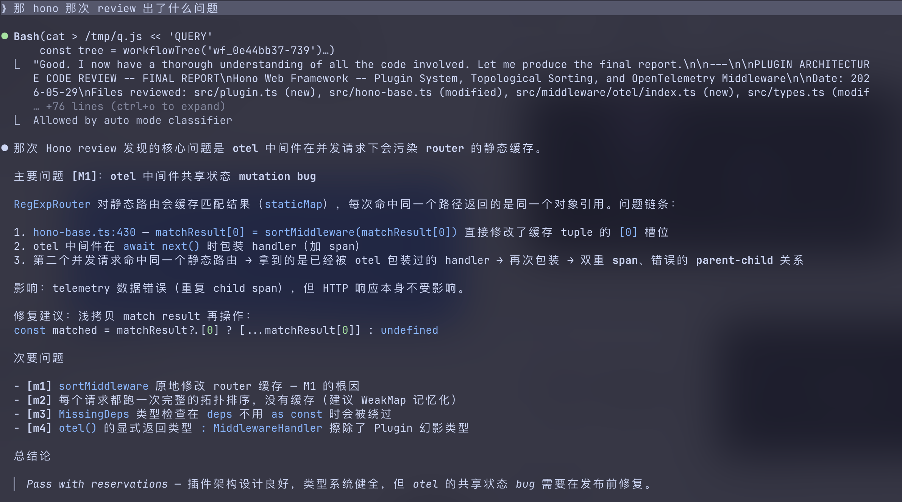

<div align="center">

<picture>
  <source media="(prefers-color-scheme: dark)" srcset=".github/assets/obelisk-wordmark-d.svg">
  
</picture>

Every past session, subagent, and workflow — searchable in natural language.

</picture>

</div>

<br />

<div align="center">
  
  <br />
  <p>Ask in plain language. The agent writes the query, runs it, answers.</p>
</div>

---

## What you can ask

```
/obelisk 上次那个 auth 的 bug 我怎么修的
/obelisk 哪些文件这周被反复修改
/obelisk 最近 workflow 跑出来什么结果
/obelisk 我让 subagent 做过哪些代码 review
```

Anything Claude Code has done before — sessions, tool calls, subagents, workflows — is indexed and searchable. Ask in your own words.

## Install

```bash
npx skills add tommy0103/obelisk
```

Or manually: copy `obelisk/` into your project's `.claude/skills/`.

Then in any Claude Code session:

```
/obelisk <your question>
```

First run builds the index (~5 seconds for 100 sessions). After that it rebuilds incrementally.

### Requires 

- Node.js 22+ (uses built-in node:sqlite with FTS5)
- Claude Code with skills support.

## What gets indexed

| Layer | Source | What's captured |
|-------|--------|----------------|
| **Sessions** | `<project>/<sessionId>.jsonl` | Title, project, timestamps, git branch |
| **Messages** | user + assistant turns | Full text, model, token usage, parent chain |
| **Tool calls** | every tool invocation | Tool name, input, file paths touched |
| **Subagents** | `subagents/agent-<id>.jsonl` | Agent type, description, full conversation |
| **Workflows** | `workflows/wf_<runId>.json` | Script, structured result, agent count |
| **Workflow agents** | `subagents/workflows/wf_<runId>/` | Per-agent transcripts linked to workflow |

Full-text search via FTS5 covers all message text across every layer.

## How it works

```
You ask a question
  ↓
Agent writes a JS query against the SQLite index
  ↓
Runs it via node runtime.mjs --query <script>
  ↓
Reads the JSON result, answers you in natural language
```

The core idea: **don't design a query DSL** — let the agent write code. An agent that can write workflow scripts can also write query scripts. Same sandbox, same mental model.

The agent has a two-tier API. Most questions only need the simple layer:

**Simple API** — taught directly in the skill prompt:

- `search(text)` — FTS5 full-text search, returns matches with surrounding context
- `context(uuid)` — full story around a message (parent chain, subagent/workflow metadata)
- `sql(query, ...params)` — raw SQL for anything else

**Advanced API** — agent reads `references/schema.md` on demand:

- `trace()` · `thread()` · `subagents()` · `workflows()` · `workflowTree()` · `fileHistory()` · `failures()` · `recent()`

The design is progressive disclosure: the agent doesn't see the full schema until it needs it.

## Structure

```
.claude/skills/obelisk/
├── SKILL.md              # Skill definition + simple API + examples
├── scripts/
│   └── runtime.mjs       # Indexer + query runtime (400 lines, zero deps)
└── references/
    └── schema.md          # Full table schema + advanced API + query patterns
```

## Design

The index rebuilds incrementally — only new or modified JSONL files are re-parsed.

Zero npm dependencies. Uses Node 22's built-in node:sqlite with FTS5. The entire runtime is ~400 lines.

20K lines of scattered JSONL → something the agent can search() and sql() against in milliseconds.

---

## License

MIT @tommy0103


